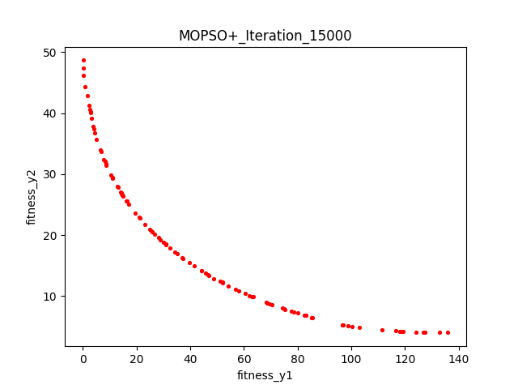
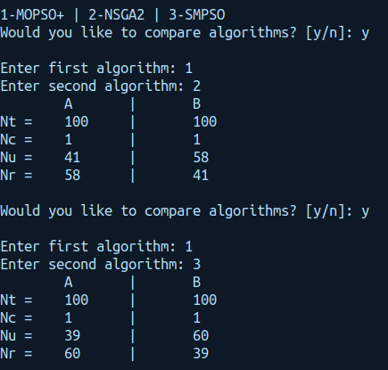
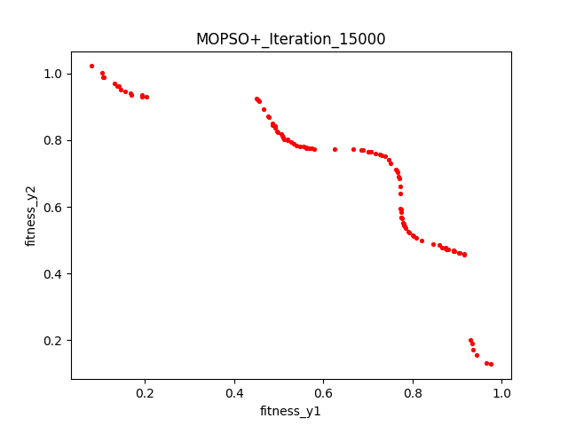
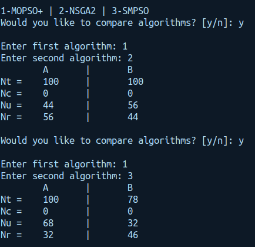
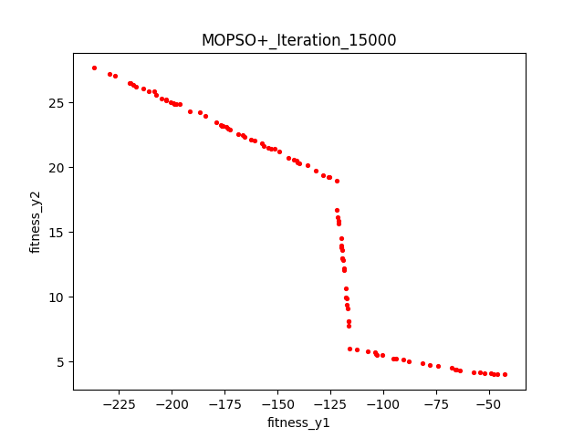
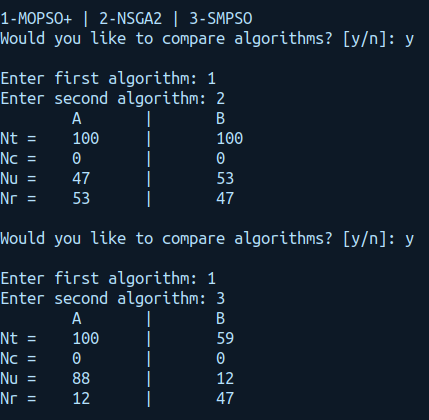
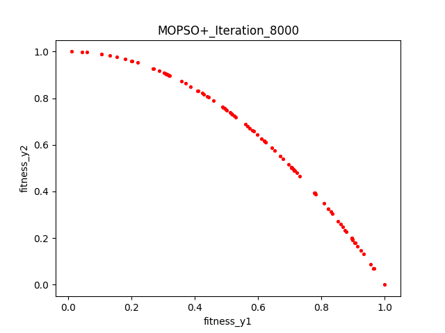
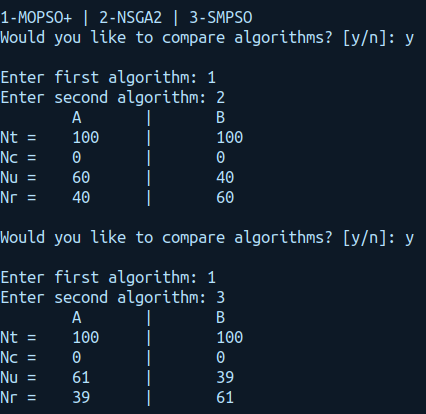

# hybrid-mopso
Implementation of Augmented Multiobjective Particle Swarm Optimization algorithm (MOPSO hybridized with local search).

## How to run
* Clone the project to a directory of choice using `git clone https://github.com/siddarthgopalakrishnan/hybrid-mopso.git`
* Change into the project directory
* Create a virtual environment by running `python3 -m venv <name_of_venv>`
* Activate the venv using `source <name_of_venv>/bin/activate`
* Install the required libraries
* Run the code by running `python3 main.py`

## Multiobjective test functions
* Binh and Korn (2 input dimensions, 2 output dimensions)
* Tanaka (2 input dimensions, 2 output dimensions)
* Osyczka (6 input dimensions, 2 output dimensions)
* Zitzler-Deb-Thiele (ZDT2) (30 input dimensions, 2 output dimensions)

The algorithm was tested only on two-objective functions, although it works for many objective functions as well, with an obvious increase in the computational complexity.

## Results

* Running times (in seconds) of the algorithms for the above test functions

| Algorithm | `Binh` | `Tanaka` | `Osyczka` | `ZDT2` |
| :---------: | :---------: | :---------: | :---------: | :---------: |
| MOPSO+ | 107 | 51 | 76.75 | 127.4 |
| SMPSO | 3.6 | 0.72 | 0.97 | 3.3 |
| NSGA2 | 1.3 | 1.21 | 1.22 | 1.38 |

* For comparing the solutions of the algorithm, we use the comparison method suggested by the 4th reference paper where they see the contribution of each algorithm. To give a brief explanation of the method, we take the pareto fronts of algorithms A and B, and see how many solutions in the combined pareto front are contributed by algorithms A and B.
    - Nt: Total elements present in each pareto front
    - Nc: Common solutions that have been contributed by both algorithms
    - Nu: Unique solutions contributed by each algorithm
    - Nr: Number of solutions removed during the process of merging the pareto fronts
    
* With these statistics, we can observe the Nu and Nc and comment on the performance of both the algorithms.

| Function | MOPSO+ Pareto front | Comparison Metric |
| :---------: | :---------: | :---------: |
| `Binh` |  |  |
| `Tanaka` |   |  |
| `Osyczka` |   |  |
| `ZDT2` |   |  |

## TODO
- [ ] Discrete search spaces
- [ ] EPANET testing (resilience and diameter) (eg: Hanoi network, Two-loop network)
- [ ] Optimize non-dominated sort (currently O(M*N^2))

## References & Resources
1. Papers
    * MOPSO: a proposal for multiple objective particle swarm optimization by C.A. Coello Coello. [Paper link](https://ieeexplore.ieee.org/document/1004388)
    * Handling multiple objectives with particle swarm optimization by C.A. Coello Coello. [Paper Link](https://ieeexplore.ieee.org/abstract/document/1304847)
    * An Improved Multiobjective Particle Swarm Optimization Based on Culture Algorithms by Chunhua Jia and Hong Zhu. [Paper Link](https://www.mdpi.com/1999-4893/10/2/46)
    * Water Distribution System Design Using Multi-Objective Particle Swarm Optimisation by Mahesh B. Patil and A. Vasan. [Paper Link](https://arxiv.org/abs/1903.06127)

2. Github repositories
    * https://github.com/DevilYangS/MOPSO_python
    * https://github.com/BIMK/PlatEMO
    * https://github.com/mbuzdalov/non-dominated-sorting

3. Resources and websites
    * [pymoo library](https://pymoo.org/)
    * [jmetalPy library](https://jmetal.github.io/jMetalPy/index.html)
    * [Wikipedia optimization test functions](https://en.wikipedia.org/wiki/Test_functions_for_optimization)